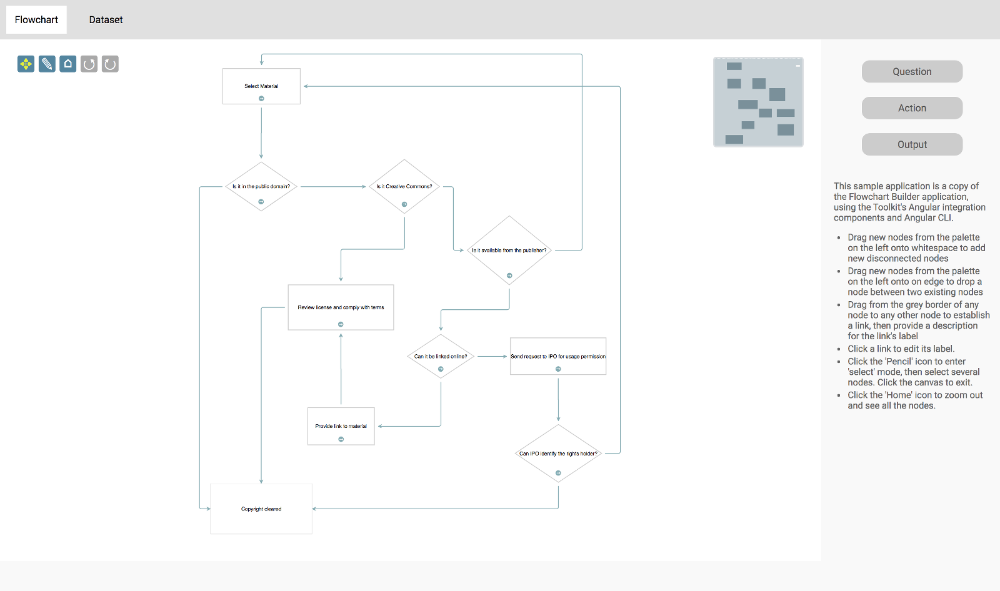
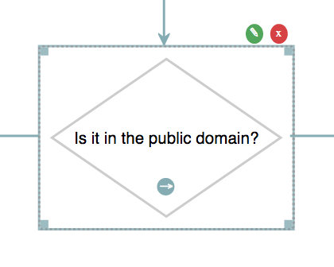
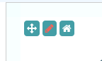
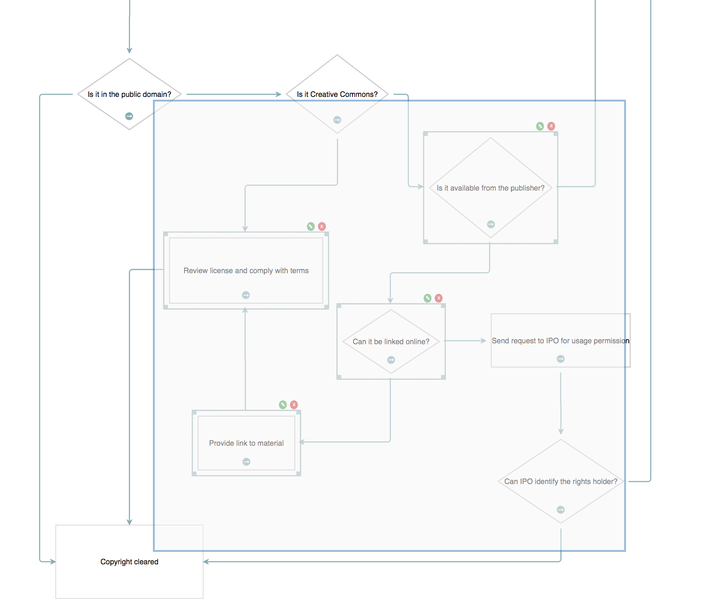

<a name="top"></a>
## Flowchart Builder (Angular)

This is a port of the Flowchart Builder application that demonstrates the Toolkit's Angular integration. All versions of Angular from
2 to 10 are supported; this demonstration uses version 9.



This page gives you an in-depth look at how the application is put together.

<a id="package"></a>
### package.json

```json
{
  "name": "jsplumb-toolkit-angular",
  "version": "2.0.0",
  "license": "Commercial",
  "scripts": {
    "ng": "ng",
    "start": "ng serve",
    "build": "ng build",
    "prod-build": "ng build --prod --base-href .",
    "lint": "ng lint",
    "tscr": "tsc -traceResolution",
    "tsc": "tsc"
  },
  "private": true,
  "dependencies": {
    "@angular/common": "^9.1.1",
    "@angular/compiler": "^9.1.1",
    "@angular/core": "^9.1.1",
    "@angular/forms": "^9.1.1",
    "@angular/platform-browser": "^9.1.1",
    "@angular/platform-browser-dynamic": "^9.1.1",
    "@angular/router": "^9.1.1",
    "jsplumbtoolkit": "file:../../jsplumbtoolkit.tgz",
    "jsplumbtoolkit-angular": "file:../../jsplumbtoolkit-angular.tgz",
    "jsplumbtoolkit-angular-drop": "file:../../jsplumbtoolkit-angular-drop.tgz",
    "jsplumbtoolkit-demo-support": "file:../../jsplumbtoolkit-demo-support.tgz",
    "jsplumbtoolkit-drop": "file:../../jsplumbtoolkit-drop.tgz",
    "jsplumbtoolkit-syntax-highlighter": "file:../../jsplumbtoolkit-syntax-highlighter.tgz",
    "jsplumbtoolkit-editable-connectors": "file:../../jsplumbtoolkit-editable-connectors.tgz",
    "core-js": "^2.4.1",
    "rxjs": "^6.5.3",
    "rxjs-compat": "^6.0.0-rc.0",
    "tslib": "^1.10.0",
    "zone.js": "~0.10.2"
  },
  "devDependencies": {
    "@angular-devkit/build-angular": "~0.901.1",
    "@angular-devkit/schematics": "^9.1.1",
    "@angular/cli": "9.1.1",
    "@angular/compiler-cli": "^9.1.1",
    "@types/jasmine": "2.5.38",
    "@types/node": "^12.11.1",
    "codelyzer": "^5.1.2",
    "ts-node": "~2.0.0",
    "tslint": "~4.4.2",
    "typescript": "~3.8.3"
  }
}

```

There are seven entries specific to jsPlumb:

```json
{
  "jsplumbtoolkit": "file:./jsplumbtoolkit.tgz",                            // main toolkit code
  "jsplumbtoolkit-angular": "file:./jsplumbtoolkit-angular.tgz",            // angular integration
  "jsplumbtoolkit-angular-drop": "file:./jsplumbtoolkit-angular-drop.tgz",  // angular drag/drop components
  "jsplumbtoolkit-demo-support": "file:./jsplumbtoolkit-demo-support.tgz",  // support code for toolkit demos
  "jsplumbtoolkit-drop": "file:./jsplumbtoolkit-drop.tgz",                  // drag/drop manager
  "jsplumbtoolkit-syntax-highlighter": "file:./jsplumbtoolkit-syntax-highlighter.tgz", // used to show the current dataset
  "jsplumbtoolkit-editable-connectors": "file:./jsplumbtoolkit-editable-connectors.tgz", // draggable flowchart connectors
}
```


[TOP](#top)

---

<a name="setup"></a>
### Page Setup

#### CSS


Angular CLI expects a CSS file to be placed at `src/styles.css`. Our `styles.css` contains
styles for the demo and also imports 4 other css files:

- `syntax-highlighter.css`     For the Dataset component

- `jsplumbtoolkit.css`   Provides sane defaults for the Toolkit. You should start building your app with this in the cascade; you can
remove it eventually, of course, but you just need to ensure you have provided values elsewhere in your CSS. Generally the safest thing to
do is to just include it at the top of your cascade.

- `jsplumbtoolkit-demo-support.css`   Some basic common styles for all the demo pages.

- `flowchart-demo.css` The styles from the non-Angular Flowchart Builder demonstration


[TOP](#top)

---

<a name="typescript-setup"></a>
### Typescript Setup

This is the `tsconfig.json` file used by this demonstration:

```javascript
{
  "compileOnSave": false,
  "compilerOptions": {
    "outDir": "./dist/out-tsc",
    "sourceMap": true,
    "declaration": false,
    "moduleResolution": "node",
    "emitDecoratorMetadata": true,
    "experimentalDecorators": true,
    "lib": [ "es2015", "dom" ]
  }
}
```

[TOP](#top)

---

<a name="bootstrap"></a>
### Bootstrap

The application is bootstrapped inside `src/main.ts`:

```javascript
import { enableProdMode } from '@angular/core';
import { platformBrowserDynamic } from '@angular/platform-browser-dynamic';
import { environment } from './environments/environment';
import { AppModule }              from './app.module';
import { jsPlumbToolkit } from "jsplumbtoolkit";

if (environment.production) {
    enableProdMode();
}

jsPlumbToolkit.ready(() => {
    platformBrowserDynamic().bootstrapModule(AppModule);
});


```

Here, `app` is a module defined in `src/app.module.ts`:

```javascript
import { NgModule, CUSTOM_ELEMENTS_SCHEMA }      from '@angular/core';
import { BrowserModule } from '@angular/platform-browser';
import { AppComponent }  from './app.component';
import { jsPlumbToolkitModule } from "jsplumbtoolkit-angular";
import { jsPlumbToolkitDragDropModule } from "jsplumbtoolkit-angular-drop";

import { Dialogs } from "jsplumbtoolkit";
import { ROUTING } from './app.routing';
import { DatasetComponent } from "./dataset";

import { FlowchartComponent } from './flowchart';
import {ActionNodeComponent, QuestionNodeComponent, OutputNodeComponent, StartNodeComponent } from "./components";

@NgModule({
    imports:[ BrowserModule, jsPlumbToolkitModule, jsPlumbToolkitDragDropModule, ROUTING],
    declarations: [ AppComponent, QuestionNodeComponent, ActionNodeComponent, StartNodeComponent, OutputNodeComponent, DatasetComponent, FlowchartComponent ],
    bootstrap:    [ AppComponent ],
    entryComponents: [ QuestionNodeComponent, ActionNodeComponent, StartNodeComponent, OutputNodeComponent ],
    schemas:[ CUSTOM_ELEMENTS_SCHEMA ]
})
export class AppModule {
    constructor() {
        // initialize dialogs
        Dialogs.initialize({
            selector: ".dlg"
        });
    }
}

```

[TOP](#top)

---

<a name="polyfills"></a>
### Polyfills

Angular requires polyfills in order to work with IE 9, 10 and 11.  In this demo we enable the following polyfills in
the `polyfills.ts` file:

```javascript
import 'core-js/es6/symbol';
import 'core-js/es6/object';
import 'core-js/es6/function';
import 'core-js/es6/parse-int';
import 'core-js/es6/parse-float';
import 'core-js/es6/number';
import 'core-js/es6/math';
import 'core-js/es6/string';
import 'core-js/es6/date';
import 'core-js/es6/array';
import 'core-js/es6/regexp';
import 'core-js/es6/map';
import 'core-js/es6/set';
```

For more information about polyfills, see [the Angular documentation](https://angular.io/guide/browser-support).

[TOP](#top)

---


<a name="demo-component"></a>
### Demo Component

The demo is written as a root level demo component, which has two child components - the first is the `flowchart` component,
which draws the flowchart, using several jsPlumb Toolkit components. The second is the `dataset` component, which dumps out the 
current contents of the dataset in syntax highlighted json. We use Angular routing to switch between the two components. 

In the HTML file, the demo component is declared with a single element:

```html
<app-demo>Loading Flowchart Builder...</app-demo>
```

<a name="demoComponentTemplate"></a>
#### Template

The `app-demo` component is created inside the file `src/app.component.ts`. Its template looks like this:

```html
<nav>
    <a routerLink="/home" style="cursor:pointer;">Flowchart</a>
    <a routerLink="/data" style="cursor:pointer;">Dataset</a>
</nav>
<router-outlet></router-outlet>
```

The demo component provides a navigation bar with two targets, and a router outlet for the current view.

<a name="demoComponentCode"></a>
#### Implementation

This is the code for the demo component:

```javascript
export class AppComponent {

    @ViewChild(FlowchartComponent) flowchart:FlowchartComponent;
    @ViewChild(DatasetComponent) dataset:DatasetComponent;
    
    toolkitId:string;
    toolkit:jsPlumbToolkit;
    
    constructor(private $jsplumb:jsPlumbService, private elementRef:ElementRef) {
      this.toolkitId = this.elementRef.nativeElement.getAttribute("toolkitId");
    }
    
    ngOnInit() {
      this.toolkit = this.$jsplumb.getToolkit(this.toolkitId, this.toolkitParams)
    }
    
    ngAfterViewInit() {
      this.toolkit.load({ url:"data/flowchart-1.json" });
    }
    
    toolkitParams = {
        nodeFactory:(type:string, data:any, callback:Function) => {
          Dialogs.show({
            id: "dlgText",
            title: "Enter " + type + " name:",
            onOK: (d:any) => {
              data.text = d.text;
              // if the user entered a name...
              if (data.text) {
                // and it was at least 2 chars
                if (data.text.length >= 2) {
                  // set an id and continue.
                  data.id = jsPlumbToolkitUtil.uuid();
                  callback(data);
                }
                else
                // else advise the user.
                  alert(type + " names must be at least 2 characters!");
              }
              // else...do not proceed.
            }
          });
        },
        beforeStartConnect:(node:any, edgeType:string) => {
          return { label:"..." };
        }
    }
}
```

It has three responsibilities:

##### 1. Creating an instance of the jsPlumb Toolkit.

We do this in two parts. Firstly, we inject the element into the component's constructor, and read out the ID we should use
for the Toolkit instance from an attribute on this element (remember this is the root component; it cannot be injected into via
`Input` statements). Secondly, in `ngOnInit`, we create an instance of the Toolkit, via the jsPlumb Service, using the class member
`toolkitParams` This Toolkit instance persists for the life of the page load; when child components are instantiated they 
then render the underlying contents. When the user switches routes, the current component is destroyed, but the 
associated Toolkit instance is not.
 
```javascript
toolkitParams = {
    nodeFactory:(type:string, data:any, callback:Function) => {
      Dialogs.show({
        id: "dlgText",
        title: "Enter " + type + " name:",
        onOK: (d:any) => {
          data.text = d.text;
          // if the user entered a name...
          if (data.text) {
            // and it was at least 2 chars
            if (data.text.length >= 2) {
              // set an id and continue.
              data.id = jsPlumbToolkitUtil.uuid();
              callback(data);
            }
            else
            // else advise the user.
              alert(type + " names must be at least 2 characters!");
          }
          // else...do not proceed.
        }
      });
    },
    beforeStartConnect:(node:any, edgeType:string) => {
      return { label:"..." };
    }
  }
```

We provide a `nodeFactory`, which is a function that jsPlumb calls when a new node is dropped onto the canvas. The node factory is given the type of the node and any initial data (that was created via the `dataGenerator` plugged in to the drag/drop mechanism), and a callback function that should be called with the given data if the factory wishes to proceed. In our implementation we popup a dialog prompting the user for a node name, and if that name is two or more characters in length, we generate a random ID and hit the callback. If the name is less than two characters in length we do not proceed.

We also provide a `beforeStartConnect` function, which returns an object. This object is used as the initial data for the edge that is being drawn.

##### 2. Acting as the parent for the dataset and flowchart components

We declare a `FlowchartComponent` and a `DatasetComponent` as view children of the main component. These are created by Angular whenever the related route becomes active.

##### 3. Loading the initial data (in the `ngAfterViewInit` method)

We do this in `ngAfterViewInit`. We know that this method will only be called one time in the life of this demonstration so it's safe to do it here.

<a name="routing"></a>
#### Routing
 
Routes are declared in `src/app.routing.ts`:
 
```javascript
import { RouterModule, Routes } from '@angular/router';
import { ModuleWithProviders } from '@angular/core/src/metadata/ng_module';
import { DatasetComponent } from "./dataset";
import { FlowchartComponent } from "./flowchart";

export const AppRoutes: Routes = [
  { path: '', redirectTo: 'home', pathMatch: 'full' },
  { path: 'home', component: FlowchartComponent },
  { path: 'data', component: DatasetComponent }
];

export const ROUTING: ModuleWithProviders = RouterModule.forRoot(AppRoutes, {useHash: true});

```

In this demonstration we use the hash based router, but you can use path based routing, it doesn't matter to jsPlumb. 


This routing module is then imported (along with the required Angular routing imports) in `app.module.ts`:

```javascript
import { RouterModule, Routes } from '@angular/router';
import { ModuleWithProviders } from '@angular/core/src/metadata/ng_module';
...
import { ROUTING } from './app.routing';

...

@NgModule({
    imports:[ BrowserModule, jsPlumbToolkitModule, ROUTING],
    ...
    
})
```

[TOP](#top)

---

<a name="flowchart-component"></a>
### Flowchart Component

This component draws the flowchart, using several Toolkit components. The business logic of this demo is mostly
contained within this component - it is responsible for rendering the diagram and for allowing edit/deletion/addition of
nodes and edges. This component can be found in the file `flowchart.ts`.

<a name="flowchart-component-declaration"></a>
#### Declaration

```javascript
@Component({
  selector: 'jsplumb-flowchart',
  template: `
    <div class="sidebar node-palette" jsplumb-surface-drop selector="div" 
             surfaceId="flowchartSurface" 
             [dataGenerator]="dataGenerator">
          <div *ngFor="let nodeType of nodeTypes" class="sidebar-item" [attr.data-node-type]="nodeType.type" title="Drag to add new" [attr.jtk-width]="nodeType.w" [attr.jtk-height]="nodeType.h">{{nodeType.label}}</div>
        </div>
        <jsplumb-surface [surfaceId]="surfaceId" [toolkitId]="toolkitId" [view]="view" [renderParams]="renderParams"></jsplumb-surface>
        <jsplumb-miniview [surfaceId]="surfaceId"></jsplumb-miniview>
        <jsplumb-controls [surfaceId]="surfaceId"></jsplumb-controls>
`
})
```

The template uses 3 components offered by the Toolkit's Angular integration: a Surface, a Miniview, and a Surface Drop Manager from which new items can be dragged onto the canvas. Additionally, we use a `jsplumb-controls` component, which is [a simple component shipped with this demonstration](https://docs.jsplumbtoolkit.com/toolkit/current/articles/angular-integration#controls) that offers lasso/pan/zoom/undo/redo.

**Points to note:**

- The first div in the template is a Drop manager component. In Angular, components are identified by a `selector`, which needs only to be a valid CSS3 selector. The Drop Manager component's selector is `[jsplumb-drag-drop]`, so the first div is considered to be a Drop Manager component.

- The Surface Drop Manager is given the ID of the Surface to attach itself to (see below)

- We pass in `renderParams` (parameters for the Surface constructor) to the `jsplumb-surface` component. We also provide a `nodeResolver`, 
whose job it is to map node types to components.

- We assign a `surfaceId` and a `jtkId` to the Surface component. `jtkId` is set to `"toolkitId"`, which is declared on the component. We use this Toolkit ID in various places in this demo. The given`surfaceId` is used by the Palette, Miniview and Controls components to identify which Surface to attach to.

- We provide the ID of the Surface to attach the `jsplumb-miniview` to.

- We provide the ID of the Surface to attach the `jsplumb-controls` to.

<a name="renderParams"></a>
#### Rendering Parameters

The parameters passed in to the Surface's constructor are:
 
 
```javascript
renderParams = {
    layout:{
        type:"Spring"
    },
    events: {
        edgeAdded:(params:any) => {
            if (params.addedByMouse) {
                this.editLabel(params.edge);
            }
        }
    },
    consumeRightClick:false,
    dragOptions: {
        filter: ".jtk-draw-handle, .node-action, .node-action i"
    }
}
```


<a name="view"></a>
#### View

The view contains the definitions of node/edge appearance and behaviour:

```javascript
view = {
    nodes:{
        "start":{
            component:StartComponent
        },
        "selectable": {
            events: {
                tap: (params:any) => {
                    this.toggleSelection(params.node);
                }
            }
        },
        "question":{
            parent:"selectable",
            component:QuestionComponent
        },
        "output":{
            parent:"selectable",
            component:OutputComponent
        },
        "action":{
            parent:"selectable",
            component:ActionComponent
        }
    },
    edges: {
        "default": {
            anchor:"AutoDefault",
            endpoint:"Blank",
            connector: ["Flowchart", { cornerRadius: 5 } ],
            paintStyle: { strokeWidth: 2, stroke: "#f76258", outlineWidth: 3, outlineStroke: "transparent" },	//	paint style for this edge type.
            hoverPaintStyle: { strokeWidth: 2, stroke: "rgb(67,67,67)" }, // hover paint style for this edge type.
            events: {
                click:(p) => {
                    (<any>this.surface).startEditing(p.edge, {
                        deleteButton:true,
                        onMaybeDelete:(edge:Edge, conn:Connection, doDelete:Function) => {
                            Dialogs.show({
                                id: "dlgConfirm",
                                data: {
                                    msg: "Delete Edge"
                                },
                                onOK: doDelete
                            });
                        }
                    });
                }
            },
            overlays: [
                [ "Arrow", { location: 1, width: 10, length: 10 }]
            ]
        },
        "connection":{
            parent:"default",
            overlays:[
                [
                    "Label", {
                    label: "${label}",
                    events:{
                        click:(params:any) => {
                            this.editLabel(params.edge);
                        }
                    }
                }
                ]
            ]
        }
    },
    ports: {
        "start": {
            endpoint: "Blank",
            anchor: "Continuous",
            uniqueEndpoint: true,
            edgeType: "default"
        },
        "source": {
            endpoint: "Blank",
            paintStyle: {fill: "#84acb3"},
            anchor: "AutoDefault",
            maxConnections: -1,
            edgeType: "connection"
        },
        "target": {
            maxConnections: -1,
            endpoint: "Blank",
            anchor: "AutoDefault",
            paintStyle: {fill: "#84acb3"},
            isTarget: true
        }
    }
}
```
<a name="initialisation"></a>
#### Initialisation

The `ngAfterViewInit` method of the flowchart component looks like this:

```javascript
ngAfterViewInit() {
    this.surface = this.surfaceComponent.surface;
    this.toolkit = this.surface.getToolkit();

    new DrawingTools({
      renderer: this.surface
    });
  }

```

<a name="node-components"></a>
#### Node Components

There are four components used to render nodes - one each for the node types of `Question`, `Action` and `Output`, and one 
for the `Start` node.  Each component extends the [BaseEditableNodeComponent](#base-editable-node), which itself extends the
Toolkit's `BaseNodeComponent`. You must ensure your node components extend `BaseNodeComponent`.

##### StartComponent

```
@Component({ templateUrl:"templates/start.html" })
export class StartNodeComponent extends BaseEditableNodeComponent  { }
```

```xml
<div [style.width]="obj.w + 'px'" [style.height]="obj.h +'px'" class="flowchart-object flowchart-start">
    <div style="position:relative">
        <svg [attr.width]="obj.w" [attr.height]="obj.h">
            <ellipse [attr.cx]="obj.w/2" [attr.cy]="obj.h/2" [attr.rx]="(obj.w/2) - 10" [attr.ry]="(obj.h/2) - 10" class="inner"/>
            <text text-anchor="middle" [attr.x]="obj.w / 2" [attr.y]="obj.h / 2" dominant-baseline="central">{{obj.text}}</text>
        </svg>
    </div>
  <div class="drag-start connect"></div>
    <jtk-source port-type="start" filter=".connect" filter-negate="true"></jtk-source>
</div>
```

The **Start** node consists of an ellipse with a text label centered inside of it. Note that all references to the node data that is being rendered are prefixed 
with `obj.`. For instance, the first line in the template here is:

```xml
<div [style.width]="obj.w + 'px'" [style.height]="obj.h +'px'" class="flowchart-object flowchart-start">
```

As with the default templating mechanism (and in contrast to the Toolkit's Angular 1.x integration), we expect one
root element per template. 

The `jtk-source` element declares that this node is an edge source, of type `start` (the `port-type` attribute 
specifies this).  The `filter` attribute instructs the Toolkit to enable drag only from some element that is not a 
child of an `svg` element, but then `filter-negate` is `true`: the result is that dragging will begin only from a 
descendant of the `svg` element. What this means visually is that the user will not be able to start a drag from the 
whitespace surrounding the ellipse.


##### QuestionComponent


```javascript
@Component({ templateUrl:"templates/question.html" })
export class QuestionNodeComponent extends BaseEditableNodeComponent { }
```

```xml
<div [style.width]="obj.w + 'px'" [style.height]="obj.h +'px'" class="flowchart-object flowchart-question">
    <div>
        <svg [attr.width]="obj.w" [attr.height]="obj.h">
            <path [attr.d]="'M ' + obj.w/2 + ' 10 L ' + (obj.w-10) + ' ' + obj.h/2 + ' L ' + obj.w/2 + ' ' + (obj.h-10) + ' L 10 ' + obj.h/2 + ' Z'" class="inner"/>
            <text text-anchor="middle" [attr.x]="obj.w/2" [attr.y]="obj.h/2" dominant-baseline="central">{{obj.text}}</text>
        </svg>
    </div>
    <div class="node-edit node-action" (click)="editNode()"></div>
    <div class="node-delete node-action delete" (click)="removeNode()"></div>
    <div class="drag-start connect"></div>
    <jtk-source port-type="source" filter=".connect"></jtk-source>
    <jtk-target port-type="target"></jtk-target>
</div>
```

The `Question` node draws a diamond, and declares itself to be an edge target and source.  Note the format of the `attr.d` attributes on the `path` elements: in Angular, 
the "square bracket" syntax expects the right hand side to contain a valid Javascript expression.


##### ActionComponent

```javascript
@Component({ templateUrl:"templates/action.html" })
export class ActionNodeComponent extends BaseEditableNodeComponent  { }
```

```xml
<div [style.width]="obj.w + 'px'" [style.height]="obj.h +'px'" class="flowchart-object flowchart-action">
    <div>
        <svg [attr.width]="obj.w" [attr.height]="obj.h">
            <rect [attr.x]="10" [attr.y]="10" [attr.width]="obj.w-20" [attr.height]="obj.h-20" class="inner"/>
            <text text-anchor="middle" [attr.x]="obj.w/2" [attr.y]="obj.h/2" dominant-baseline="central">{{obj.text}}</text>
        </svg>
    </div>
    <div class="node-edit node-action" (click)="editNode()"></div>
    <div class="node-delete node-action delete" (click)="removeNode()"></div>
    <div class="drag-start connect"></div>
    <jtk-target port-type="target"></jtk-target>
    <jtk-source port-type="source" filter=".connect"></jtk-source>
</div>
```

Once again we use the position and dimensions for the node's main container as well as its SVG elements. `Action` nodes are 
configured as both edge sources and targets.

##### OutputComponent

```javascript
@Component({ templateUrl:"templates/output.html" })
export class OutputNodeComponent extends BaseEditableNodeComponent  { }
```

```xml
<div [style.width]="obj.w + 'px'" [style.height]="obj.h +'px'" class="flowchart-object flowchart-output">
    <div>
        <svg [attr.width]="obj.w" [attr.height]="obj.h">
            <rect [attr.x]="0" [attr.y]="0" [attr.width]="obj.w" [attr.height]="obj.h"/>
            <text text-anchor="middle" [attr.x]="obj.w/2" [attr.y]="obj.h/2" dominant-baseline="central">{{obj.text}}</text>
        </svg>
    </div>
    <div class="node-edit node-action" (click)="editNode()"></div>
    <div class="node-delete node-action delete" (click)="removeNode()"></div>
    <jtk-target port-type="target"></jtk-target>
</div>
```

The `Output` node is configured to be a connection target only.

[TOP](#top)

---

<a name="dragging"></a>
### Dragging new nodes

As discussed above, a `jsplumb-surface-drop` is declared, which configures all of its child `li` elements to be droppable onto
the Surface canvas.  It also offers functionality to insert a new between two nodes when it is dragged onto an edge.
When a drag begins, some initial data (including node type) is calculated by the `dataGenerator` 
method declared on the demo component:

```javascript
dataGenerator(el:Element) {
    return {
        type:el.getAttribute("jtk-node-type"),
        w:parseInt(el.getAttribute("jtk-width"), 10),
        h:parseInt(el.getAttribute("jtk-height"), 10)
    }
}
```

The Surface Drop Manager is discussed in more detail [here](https://docs.jsplumbtoolkit.com/toolkit/current/articles/surface-drop-manager), and its Angular wrapper is discussed [here](https://docs.jsplumbtoolkit.com/toolkit/current/articles/angular-integration#surface-drop-manager)

[TOP](#top)

---

<a name="behaviour"></a>
### Behaviour

In the original Flowchart Builder demo, there are three pieces of behaviour that we need to code that are not 
completely handled for us by the Toolkit:  

- Edit Node Text
- Remove Node
- Remove Edge

These exist in this Angular demo, too, but are handled slightly differently.  Each Node is declared a Component 
specific to the Node type. 

<a name="base-editable-node"></a>
#### BaseEditableNodeComponent

Every component extends `BaseEditableNodeComponent`,  which is a component specific to this demo, but which itself extends `BaseNodeComponent`, which is a component that ships with the Toolkit's angular integration code, and which all components are required to extend. The `toolkit` referred to in these code snippets is on the `BaseNodeComponent` class.
 
 
```javascript 

class BaseEditableNodeComponent extends BaseNodeComponent {

    removeNode () {
        let obj = this.getNode()
        if (obj != null) {
          if (isNode(obj)) {
            Dialogs.show({
              id: "dlgConfirm",
              data: {
                msg: "Delete '" + obj.data.text + "'"
              },
              onOK: () => {
                this.toolkit.removeNode(<Node>obj);
              }
            });
          }
        }
      }

    editNode() {
        let obj = this.getNode();
        Dialogs.show({
          id: "dlgText",
          data: obj.data,
          title: "Edit " + obj.data.type + " name",
          onOK: (data:any) => {
            if (data.text && data.text.length > 2) {
              // if name is at least 2 chars long, update the underlying data and
              // update the UI.
              this.toolkit.updateNode(obj, data);
            }
          }
        });
      }
}
```

###### Edit Node Text


```xml
<div class="node-edit node-action" (click)="editNode()">
    <i class="fa fa-pencil-square-o"></i>
</div>
```

The meat of the `editNode` method (shown above) is the same as that which the original FlowchartBuilder demo has; it's just the trigger to
launch the method that is different.

The Toolkit's `BaseNodeComponent` has a method `getNode()` which returns the node that the component is rendering. In this 
event handler, we get the current node, then show the user a dialog that will allow them to edit the node's text. If the edited text is 
at least two character long we update the model.

This application uses the Toolkit's [dialogs](dialogs) import to manage simple interactions with data members such as 
this. Your application may choose to use a different mechanism.

###### Delete Node

```xml
<div class="node-delete node-action" (click)="removeNode()">
    <i class="fa fa-times"></i>
</div>
```

As with `editNode()`, `removeNode()` calls `getNode()` on the component to get the current node. It then pops up a
confirm dialog.


###### Remove Edge

This is handled in the same way by this demo as it is in the original FlowchartBuider.

We register a `dblclick` listener on edges by providing it as an event handler to the View, on the edge type that 
acts as the parent type for all others. First a helper method (on the demo component, not on Nodes as the previous two examples were):

```javascript
removeEdge(edge:any) {
    this.toolkitComponent.toolkit.removeEdge(edge);
}
```

Then in the view:

```javascript

...

edges: {
  "default": {
    connector: ["Flowchart", { cornerRadius: 5 } ],
    paintStyle: { lineWidth: 2, strokeStyle: "#f76258", outlineWidth: 3, outlineColor: "transparent" },	
    hoverPaintStyle: { lineWidth: 2, strokeStyle: "rgb(67,67,67)" }, 
    events: {
      "dblclick": (params:any) => {
        Dialogs.show({
          id: "dlgConfirm",
          data: {
            msg: "Delete Edge"
          },
          onOK: () => { this.removeEdge(params.edge); }
        });
      }
   },

...
```

###### Editing Edge Label

All Edges except those from a *Start* node are set to be of type `connection`, which is defined in the view as follows:

```javascript
"connection":{
  parent:"default",
  overlays:[
    [ "Label", {
      label: "${label}",
      events:{
        click:(params:any) => {
          this.editLabel(params.edge);
        }
      }
    }]
  ]
}
```

We define a `click` event handler on the Label overlay which edits the label for the Edge.

The helper function is:

```javascript
editLabel(edge:any) {
    Dialogs.show({
        id: "dlgText",
        data: {
            text: edge.data.label || ""
        },
        onOK: (data:any) => {
            this.toolkitComponent.toolkit.updateEdge(edge, { label:data.text });
        }
    });
}
```

[TOP](#top)

---

<a name="resize"></a>
### Resizing nodes

To resize or a node you must first either click on it, or use the lasso (described [below](#selecting)) to select 
it.  A selected node looks like this:



The dotted line and drag handles that are added to a selected Node are put there by the Tookit's drawing tools. It listens to the Toolkit's select/deselect events and decorates UI elements accordingly. These tools are discussed in detail on [this page](https://docs.jsplumbtoolkit.com/toolkit/current/articles/drawing).

The drawing tools are initialized with this line of code (inside the `ngAfterViewInit` of the demo component):

```javascript

import { DrawingTools } from "jsplumbtoolkit"

...

new DrawingTools({
    renderer: surface
});
```

You pass them the instance of the Surface widget you're working with.

Resizing is handled automatically by the drawing tools.  By default, these tools will change the `w`, `h`, `left` and `top` values in a node's data, but this can be changed.

When a node's data is updated the drawing tools call the appropriate update method on the underlying Toolkit. The changes will be reflected immediately in the DOM.

[TOP](#top)

---

<a name="selecting"></a>
### Selecting nodes

#### Left Click

Nodes can be selected with a left-click (or tap on a touch device; `tap` is a better event to choose in general because the
Toolkit abstracts out the difference between mouse devices and touch devices and presents `click` events as `tap` events
on non touch devices).  This is configured in the `view`. In this application, 
Nodes of type _selectable_ have the capability enabled with this code:

```javascript
"selectable": {
  events: {
    tap: (params) => {
      this.toolkit.toggleSelection(params.node);
    }
  }
}
```

The `tap` event (discussed [here](widget-surface#eventlist)) is preferable to `click`, as it ensures the application responds only to true clicks on devices with a mouse, and also avoids the delay that some vendors introduce to a click event on touch devices.

#### Lasso Selection

Lasso selection is enabled by default on the Surface widget.  To activate the lasso, click the pencil icon in the toolbar:



This icon (and the others in the toolbar) are rendered by the `jsplumb-controls` component, which is something we created for the
purposes of the Angular demonstrations. It is production ready and can be used in your applications if you wish to use it, but remember its just one 
example of how to provide that functionality, and it makes a few assumptions:

- font awesome is in the page
- you want your tooltips in English
- you're using the styles declared in `jsplumbtoolkit-demo.css` 
- you want to use a css class of `controls` on the main controls container


#### Lasso Operation

The lasso works in two ways: when you drag from left to right, any node that intersects your lasso will be selected.  When you drag from right to left, only nodes that are enclosed by your 
lasso will be selected.



#### Exiting Select Mode

The Surface widget automatically exits select mode once the user has selected something. The `jsplumb-controls` component also  listen to clicks on the whitespace in the widget (in the flowchart component) and when one is detected, it clears the current selection in the underlying Toolkit:

```javascript
ngAfterViewInit() {
    ...
    this.surface.bind("canvasClick", () => this.surface.getToolkit().clearSelection());
    ...
}
```

##### Zoom To Fit

The controls component also provides the "zoom to fit" button (as shown in the component declaration discussed above).

##### Undo/redo

The controls component uses the Toolkit's built in undo/redo methods to offer undo/redo support for node, group, port and edge additions and/or removals.
 

[TOP](#top)

---

<a name="dataset-component"></a>
### Dataset Component

This component dumps the current contents of the dataset in syntax highlighted json. This component can be found in the file `dataset.ts`.


#### Declaration
```javascript
@Component({
  selector:"jsplumb-dataset",
  template:'<div class="jtk-demo-dataset"></div>'
})
```

Not a lot going on here - just a div with an appropriate class. This component draws directly into its DOM element.
 
#### Implementation

```javascript
export class DatasetComponent {
  toolkit:jsPlumbToolkit;
  updateListener:Function;

  @Input() toolkitId:string;

  constructor(private el: ElementRef, private $jsplumb:jsPlumbService) { }

  ngOnInit() {
    this.toolkit = this.$jsplumb.getToolkit("flowchart");
    this.updateListener = this.updateDataset.bind(this);
    this.toolkit.bind("dataUpdated", this.updateListener);
  }

  getNativeElement(component:any) {
    return (component.nativeElement || component._nativeElement || component.location.nativeElement).childNodes[0];
  }

  updateDataset() {

    let json = _syntaxHighlight(JSON.stringify(this.toolkit.exportData(), null, 4));
    this.getNativeElement(this.el).innerHTML = json;
  }

  ngAfterViewInit() {
    this.updateDataset();
  }

  ngOnDestroy() {
    this.toolkit.unbind("dataUpdated", this.updateListener);
  }
}
```

The component binds to the Toolkit's `dataUpdated` method, which is fired whenever any change is made to the data model.
In the `ngOnDestroy` method (which is called every time the user switches to the flowchart route), the event listener is
unbound.  We use a helper method called `_syntaxHighlight` along with a few CSS rules to do the syntax highlighting. The implementation
of this method is not in the scope of this document, but you can find the code in the licensed or evaluation download.


[TOP](#top)

---

<a name="controls-component"></a>
### Controls Component

```
import { Input, Component, ElementRef } from '@angular/core';

import {jsPlumb, Surface} from "jsplumbtoolkit";
import {jsPlumbService} from "jsplumbtoolkit-angular";

//
// This component was written for the jsPlumb Toolkit demonstrations. It's production ready of course, but it assumes that
// font awesome is available, and it assumes a couple of other styles are available (via jsplumbtoolkit-demo.css), and it has
// hardcoded labels in English. Plus it assumes that the undo manager is available.


@Component({
  selector:"jsplumb-controls",
  template:`<div class="controls">
              <i class="fa fa-arrows selected-mode" mode="pan" title="Pan Mode" (click)="panMode()"></i>
              <i class="fa fa-pencil" mode="select" title="Select Mode" (click)="selectMode()"></i>
              <i class="fa fa-home" reset title="Zoom To Fit" (click)="zoomToFit()"></i>
              <i class="fa fa-undo" undo title="Undo last action" (click)="undo()"></i>
              <i class="fa fa-repeat" redo title="Redo last action" (click)="redo()"></i>
          </div>`
})
export class ControlsComponent {

  @Input() surfaceId: string;

  surface:Surface;
  undoManager:jsPlumbToolkitUndoRedo;

  constructor(private el: ElementRef, private $jsplumb:jsPlumbService) { }

  getNativeElement(component:any) {
    return (component.nativeElement || component._nativeElement || component.location.nativeElement).childNodes[0];
  }

  panMode() {
    this.surface.setMode("pan");
  }

  selectMode() {
    this.surface.setMode("select");
  }

  zoomToFit() {
    this.surface.getToolkit().clearSelection();
    this.surface.zoomToFit();
  }

  undo() {
    this.undoManager.undo();
  }

  redo() {
    this.undoManager.redo();
  }

  ngAfterViewInit() {
    this.$jsplumb.getSurface(this.surfaceId, (s:Surface) => {

      this.surface = s;
      this.surface.bind("modeChanged", (mode:String) => {
        let controls = this.getNativeElement(this.el);
        jsPlumb.removeClass(controls.querySelectorAll("[mode]"), "selected-mode");
        jsPlumb.addClass(controls.querySelectorAll("[mode='" + mode + "']"), "selected-mode");
      });

      this.undoManager = new jsPlumbToolkitUndoRedo({
        toolkit:this.surface.getToolkit(),
        compound:true,
        onChange:(mgr:jsPlumbToolkitUndoRedo, undoSize:number, redoSize:number) => {
          let controls = this.getNativeElement(this.el);
          controls.setAttribute("can-undo", undoSize > 0);
          controls.setAttribute("can-redo", redoSize > 0);
        }
      });

      this.surface.bind("canvasClick", () => this.surface.getToolkit().clearSelection());

    });
  }
}


```


[TOP](#top)

---

<a name="dialogs"></a>
### Dialogs

The dialogs used in this app are part of the jsPlumb Toolkit core. They provide a simple abstraction around the business of getting input from the user and dealing with it; they're not necessarily fully-featured enough for all applications.

#### Initialization

To initialize the dialogs, we call `jsPlumbToolkit.Dialogs.initialize`, with an appropriate selector for the templates for your dialogs (see below for an explanation of this). In this application we do this in the constructor of the application module (`src/app.module.ts`):

```javascript

import { Dialogs } from "jsplumbtoolkit"

...

export class AppModule { 
    constructor() {
        // initialize dialogs
        Dialogs.initialize({
            selector: ".dlg"
        });
    }
}
```

#### Templates

Each dialog has a template in the HTML, with some class name that you matched in the `selector` argument to the `initialize` call above:

```xml
<script type="jtk" class="dlg" id="dlgViewQuery" title="Edit Query">
  <textarea class="txtViewQuery" jtk-focus jtk-att="query">${query}</textarea>
</script>
```

##### Binding Parameters

These templates use the same template engine as the Surface renderer, so in this example you can see we've extracted `query` from the View node's data, and injected it into the textarea. But what might not be immediately obvious is the purpose of the `jtk-att` attribute: it tells the dialog handler that the value of this textarea should be passed to the OK handler, using the key `query`.

Note also in the above example, the `jtk-focus` attribute: this tells the dialog handler that the textarea should be given the focus when the dialog first opens.

#### Showing a dialog

This example is the dialog that is shown when you edit a View query. We provide the id of the template to use for the dialog, and we provide the View node's data as the backing data for the dialog. Then we provide an `onOK` callback:

```javascript
Dialogs.show({
  id:"dlgViewQuery",
  data:info.obj.data,
  onOK:(data:any) => {
    // update data
    toolkit.updateNode(info.obj, data);
    // update UI	        		
    info.el.querySelectorAll(".view-details")[0].innerHTML = data.query;
  }
});
```

The `data` argument to the `onOK` callback consists of an object whose key value pairs are determined by the `jtk-att` attributes found in the template. Recall that above we had a textarea with `jtk-att:"query"`. This means that the `data` argument to `onOK` looks like this:

```javascript
{
  query:"the contents of the text area"
}
```

##### Supported Input Types

The list of supported input types is:

- text
- radio button(s) 
- checkbox
- select
- textarea

##### Dialog Titles

If you set a `title` attribute on a dialog's template, that value will be used for the title of the dialog. 
Alternatively, you can provide a `title` parameter to the `show` call.

##### Lifecycle Callbacks

There are three lifecycle callbacks supported:

- **onOpen** Called when the dialog has been opened. The related DOM element for the dialog is passed to this method.
- **onOK** Called when the user presses OK. The callback is provided a data object as discussed above.
- **onCancel** Called when the user presses cancel. No arguments are provided to the callback.

[TOP](#top)
